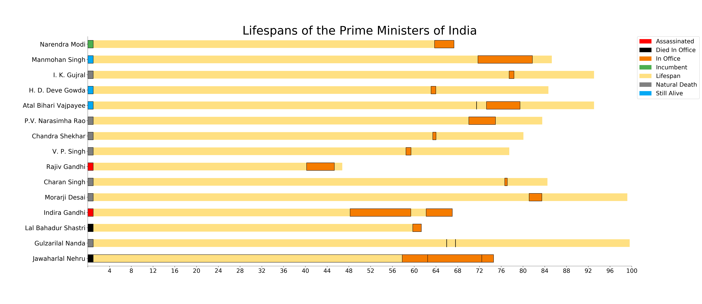

# A Study of the Lifespan and Careers of the Prime Ministers of India

---------

This post was partly inspired by the [post](https://www.reddit.com/r/dataisbeautiful/comments/7ioatb/lifespans_of_the_presidents_of_the_united_states/) made on Reddit about the US Presidents, and by a need to understand the career of the Prime Ministers as well. I will be adding additional details to this jupyter-notebook so that we can get a better perspective of the people who have held that post in the past.

