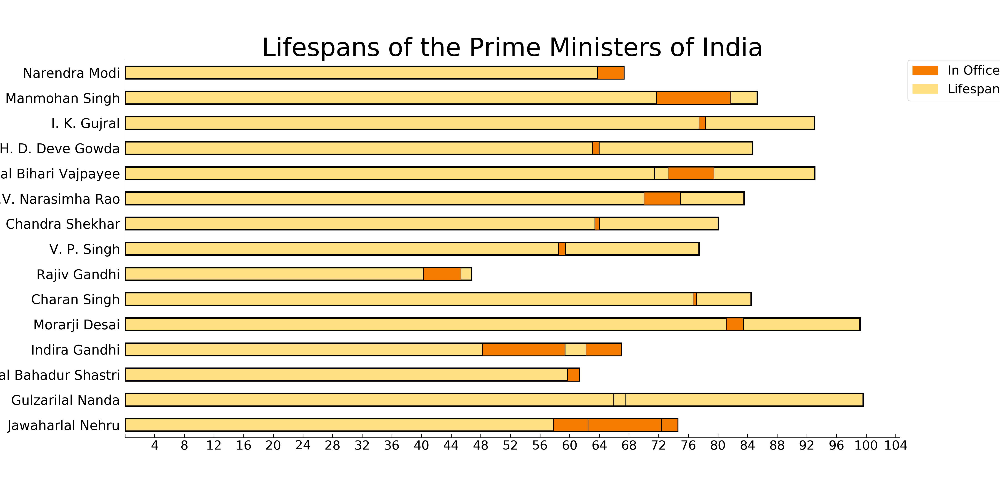

# A Study of the Lifespan and Careers of the Prime Ministers of India

---------

This post was partly inspired by the [post](https://www.reddit.com/r/dataisbeautiful/comments/7ioatb/lifespans_of_the_presidents_of_the_united_states/) made on Reddit about the US Presidents, and by a need to understand the career of the Prime Ministers as well. I will be adding additional details to this jupyter-notebook so that we can get a better perspective of the people who have held that post in the past.

The above graph is mostly representative of when during their lifespans, people have taken on the office of the Prime Minister of India. That being said, it is quite interesting to know which of the Prime Ministers were alive during each others' terms, and how the interim Prime Ministers fit into it all.

This graph shows us a timeline, in a way, of the office of Prime Minister of India. It is revealing in more ways than one, in my opinion.

## TODO:

* Plot a geographic map of where Prime Ministers were born.
* Plot a career chart, to showcase their careers before and after they held Office.
* Plot a graph showing their movement between political parties. Preferably a Sankey Chart, I think.
* Plot a timeline, using timeline.js, to showcase the overall timeline of India's Prime Ministerial office.

-----

